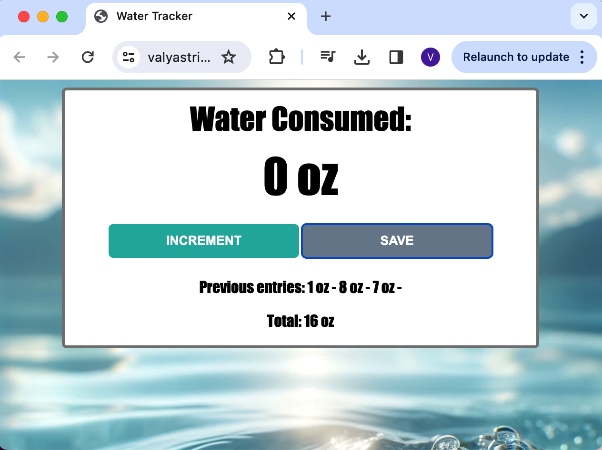

# Water Tracker

The Water Tracker is a simple web application that helps users track the number of ounces of water they drink each day. Users can increment the number of ounces by one until they reach their desired amount and then save the entry. The application displays each individual entry as well as the total number of ounces consumed.

## Table of Contents

- Installation
- Usage
- Technologies Used
- Screenshots

## Installation

To run the Water Tracker application locally:

1. Clone the repository:
  bash
  ```git clone https://github.com/yourusername/water-tracker.git```

2. Navigate to the project directory:
  ```cd water-tracker```

3. Open the index.html file in your preferred web browser.

## Deployment

The application is deployed at the following URL:

[Water Tracker Application](https://valyastriz.github.io/Water_Tracker/)

## Usage

1. Open the Water Tracker application in your web browser.
2. Click the INCREMENT button to increase the count of ounces by one.
3. Click the SAVE button to save the current count of ounces to your list of previous entries.
4. View the total number of ounces consumed for the day.

## Technologies Used

- HTML
- CSS
- JavaScript

## Screenshots



